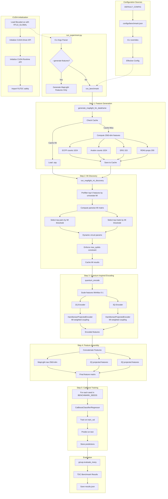

# MI-Entanglement Pipeline Architecture

This document provides a detailed view of the quantum-inspired pipeline for molecular property prediction.

> **Note**: This pipeline uses classical simulation of quantum circuits via PennyLane. The algorithm is designed for future deployment on quantum hardware.

## Pipeline Overview



## Module Responsibilities

| Module | File | Description |
|--------|------|-------------|
| Entry Point | `src/run_experiment.py` | CLI parsing, CUDA initialization, dispatch |
| Feature Generation | `src/features.py` | MapLight 2563-dim molecular descriptors |
| MI Discovery | `src/mi_discovery.py` | Univariate MI prefilter + pairwise MI for pairs/triads |
| Quantum-Inspired Encoding | `src/quantum_encoding.py` | Hamiltonian time evolution simulation |
| Encoder Core | `src/projected_q_encoder.py` | PennyLane-based HamiltonianProjectedEncoder (classical simulation) |
| Benchmark Runner | `src/benchmark.py` | Feature assembly, CatBoost training, TDC evaluation |
| Configuration | `src/config.py` | Parameters, caching, metrics |
| MI Utilities | `src/mi_entanglement_utils.py` | Pairwise MI computation, pair/triad selection |

## Data Flow

```
SMILES strings (train_val, test)
    │
    ▼
┌─────────────────────────────────────┐
│  MapLight Features (2563-dim)       │
│  ├── ECFP counts (1024)             │
│  ├── Avalon counts (1024)           │
│  ├── ErG descriptors (315)          │
│  └── RDKit properties (200)         │
└─────────────────────────────────────┘
    │
    ▼
┌─────────────────────────────────────┐
│  MI Pre-filtering                   │
│  └── Top 100 features by I(X;Y)     │
└─────────────────────────────────────┘
    │
    ▼
┌─────────────────────────────────────┐
│  Pairwise MI Matrix (100×100)       │
│  └── I(Xᵢ; Xⱼ) for feature pairs    │
└─────────────────────────────────────┘
    │
    ├──────────────────┐
    ▼                  ▼
┌──────────────┐  ┌──────────────┐
│  Top Pairs   │  │  Top Triads  │
│  (i,j)       │  │  (i,j,k)     │
│  max 30      │  │  max 15      │
└──────────────┘  └──────────────┘
    │                  │
    ▼                  ▼
┌──────────────┐  ┌──────────────┐
│  2Q Circuit  │  │  3Q Circuit  │
│  ≤28 qubits  │  │  ≤28 qubits  │
└──────────────┘  └──────────────┘
    │                  │
    ▼                  ▼
┌──────────────┐  ┌──────────────┐
│  ⟨σᶻᵢ⟩       │  │  ⟨σᶻᵢ⟩       │
│  features    │  │  features    │
└──────────────┘  └──────────────┘
    │                  │
    └────────┬─────────┘
             ▼
┌─────────────────────────────────────┐
│  Final Features                     │
│  ├── MapLight raw (2563)            │
│  ├── 2Q projections (simulated)     │
│  └── 3Q projections (simulated)     │
└─────────────────────────────────────┘
             │
             ▼
┌─────────────────────────────────────┐
│  CatBoost (5 seeds)                 │
│  └── Gradient boosted classifier    │
└─────────────────────────────────────┘
             │
             ▼
┌─────────────────────────────────────┐
│  TDC Evaluation                     │
│  └── group.evaluate_many()          │
└─────────────────────────────────────┘
```

## Caching Strategy

The pipeline caches intermediate results for efficiency:

| Cache | Location | Key | Contents |
|-------|----------|-----|----------|
| MapLight features | `cache/maplight_<hash>.npy` | SHA256 of SMILES list | NumPy array (n, 2563) |
| MI discovery | `cache/mi_phase1_<version>_<hash>_<params>.json` | Data + config hash | Pairs, triads, index maps |

Cache invalidation: Bump `CACHE_VERSION` in `config.py` when feature generation or MI logic changes.
